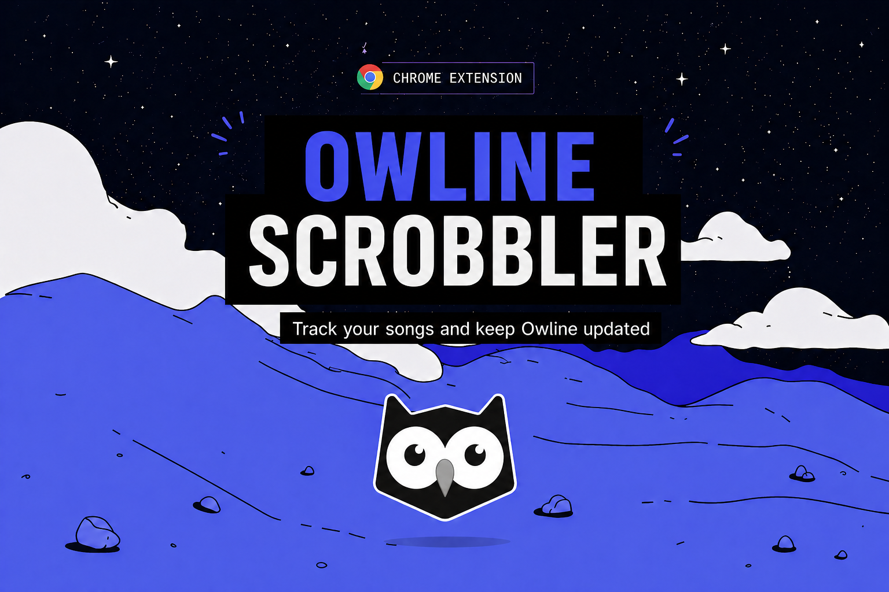

<p align="center">
  
</p>

# Owline Scrobbler — Chrome Extension

Scrobble what you listen to on Spotify, YouTube, SoundCloud, Deezer, Tidal and Amazon Music to [Owline](https://owline.io).

## How it works

1. Install the extension
2. Sign in with your Owline account (email/password or Google)
3. Play music on any supported platform
4. Tracks are automatically scrobbled after 30s of playback (or 50% of duration)

## Supported platforms

### Active players (visible in settings menu)

| Platform | Source | URL |
|----------|--------|-----|
| Spotify Web Player | `spotify` | `open.spotify.com` |
| YouTube | `youtube` | `*.youtube.com` (except `music.youtube.com`) |
| SoundCloud | `soundcloud` | `soundcloud.com` |
| Deezer | `deezer` | `www.deezer.com` |
| Tidal | `tidal` | `tidal.com`, `listen.tidal.com`, `*.tidal.com` |
| Amazon Music | `amazon_music` | `music.amazon.com` and 11 regional TLDs |

### Experimental (hidden from menu, untested DOM selectors)

YouTube Music, Apple Music, Bandcamp, Plex — adapters exist but selectors are educated guesses. Content scripts still load on matching sites; toggles will appear once each is validated against the live DOM.

### Trackers

| Tracker | Description |
|---------|-------------|
| Owline | Scrobbles sent to Owline API (enabled by default) |

## Features

- Email/password and Google Sign-In authentication
- Auto token refresh (every 20min)
- Offline queue with periodic flush (persisted in storage, max 200 tracks)
- Now Playing display with 10s freshness TTL (clears when tab closes)
- Pause detection per platform (no scrobble while paused)
- Cover art per scrobble (sent in payload, persisted as `tracks.image_url`)
- Per-provider toggle in Settings tab
- Status dot: red (logged out) → grey (idle) → green (track playing)
- Scrobble logs (last 50 attempts) — view, expand JSON payload, download, clear
- Server-side logout on sign out
- Versioned storage with migration runner

## Popup tabs

- **STATUS** — now playing + session counters (scrobbles / queued)
- **SETTINGS** — player toggles, tracker toggles, account / sign out
- **LOGS** — scrobble history with expandable JSON payload, download, clear

## Install (development)

1. `chrome://extensions/` → Enable Developer Mode
2. "Load unpacked" → select this directory
3. Click the Owline icon → Sign in

## Architecture

```
manifest.json            — MV3 manifest, CSP, content scripts per platform
background.js            — Service worker: scrobble API, queue, auth, OAuth, logs
shared/
  config.js              — OWLINE.CONFIG (constants, provider categories)
  storage-keys.js        — OWLINE.KEYS, SESSION_KEYS
  api.js                 — OWLINE.api (login, oauth, refresh, me, logout, postScrobble)
  auth.js                — OWLINE.auth (token storage, refresh)
  providers.js           — OWLINE.providers (per-provider toggle, category-aware)
  migrations.js          — OWLINE.migrations (storage versioning)
content/
  base.js                — Shared polling, heartbeat, provider gating
  providers/
    spotify.js           — Spotify Web Player
    youtube.js           — YouTube
    youtube-music.js     — YouTube Music (experimental)
    soundcloud.js        — SoundCloud
    deezer.js            — Deezer
    tidal.js             — Tidal
    amazon-music.js      — Amazon Music
    apple-music.js       — Apple Music (experimental)
    bandcamp.js          — Bandcamp (experimental)
    plex.js              — Plex (experimental)
popup/
  popup.html             — Tabs (Status / Settings / Logs)
  popup.css              — Styles
  popup.js               — UI logic, providers panel, log rendering
tests/
  api.test.js            — extractToken, extractUser
  background.test.js     — buildPayload, debounce, scrobble threshold
  config.test.js         — PROVIDERS, PROVIDER_CATEGORIES, defaults
  duration.test.js       — parseDurationText
  providers.test.js      — get, setEnabled, isEnabled, defaults, overrides
  helpers/dom.js         — DOM mock helper for provider tests
  providers/             — per-adapter tests (10 files)
icons/                   — Extension icons (16, 48, 128)
```

## Scrobble payload

Each scrobble sent to `POST /api/v1/scrobbles`:

```json
{
  "track": "Song Title",
  "artist": "Artist Name",
  "album": "Album Name or null",
  "cover_url": "https://.../cover.jpg or null",
  "duration": 240,
  "source": "spotify"
}
```

`cover_url` is captured by each adapter when available (DOM image src or attribute) and persisted server-side as `tracks.image_url`. The user-stats top tracks endpoint falls back to `albums.cover_url` when track image is missing, so historical Last.fm imports still display covers.

## Scrobble rules

- Min 30s of playback OR 50% of track duration (whichever is less)
- 5s debounce between same track (persisted, survives service worker restarts)
- Tracks > 20min skipped (likely podcasts/mixes) — YouTube, SoundCloud, Bandcamp
- Skips when player is paused (each adapter detects pause state)
- Offline queue persisted in `chrome.storage.local` (max 200, flushes every 5min)
- Flush stops after 3 failed attempts to avoid infinite retry

## Testing

```bash
npm test
```

68 tests — uses Node's built-in test runner, zero dependencies.

## Storage keys

All keys are namespaced under `owline_*` and exposed via `OWLINE.KEYS`. Provider settings (`owline_providers`) and storage version (`owline_storage_version`) survive logout; everything else is cleared on sign out.

## Validating a new player adapter

Adapters for experimental providers (YouTube Music, Apple Music, Bandcamp, Plex) need DOM validation. Process:

1. Open the player site, play a track
2. F12 → Console, run a snippet listing relevant `data-test`/class attributes around the player bar
3. Adjust the adapter's `getTrackInfo`, `isPlaying`, `getPlayer` selectors to match live DOM
4. Move the source name from `PROVIDER_CATEGORIES.experimental` to `players` in `shared/config.js`

This is how Spotify, SoundCloud, Amazon Music, Deezer and Tidal were validated.
